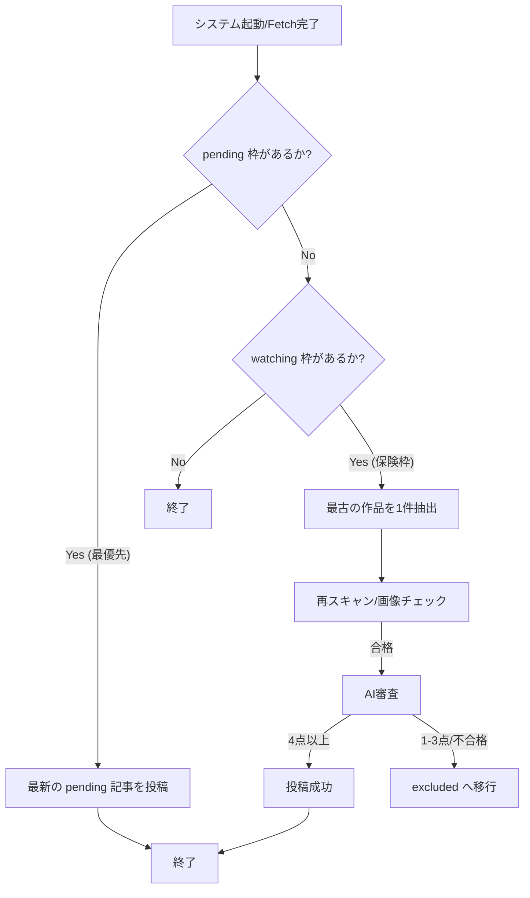

# Novelove 自動投稿システム 技術詳細仕様書 (v8.5.2)

本ドキュメントは、Novelove（ノベラブ）システムの内部ロジック、データ構造、および運用ルールを網羅した「エンジニア・運用者向け」の技術参照資料です。

> [!NOTE]
> **README.md との違い**:
> - **README.md**: 「プロジェクトの概要」「設置方法」「GitHub連携の手順」などの、プロジェクトの顔となる情報を記述。
> - **SPECIFICATIONS.md**: 「具体的などう動くか」「判定基準は何か」「DBの状態定義」などの、修正・メンテナンス時に必要な内部ロジックを詳述。

---

## 🏗 1. 投稿選抜ロジック (Selection Priority)

システムは 1 回の実行につき、最大 1 件の投稿を行います。その選抜フローは以下の通りです。

### 1-1. 新着優先 (Pending) モード
- **トリガー**: `fetch_and_stock_all` 時に、新作かつ高評価（AI採点 4.0〜5.0）だったもの。
- **挙動**: DBの `status='pending'` 枠を最優先で 1 件処理します。

### 1-2. 保険枠 (Insurance/Queue Processing)
- **目的**: 投稿するものがない「空き時間」に、過去の未審査・待機作品を古い順に 1 件ずつ消化します。
- **ターゲット**: `status='watching'` かつ `release_date`（発売日）が今日以前のもの。
- **再審査プロセス**: 
    - サイトを再スクレイピングし、あらすじ・画像を最新化。
    - 画像が揃っていない、またはノイズ（ボイス等）と判定された場合は、その場で `excluded` にし行列から除外。
    - 合格したものだけが投稿されます。

---

## 🗄 2. データベースステータス定義

`novelove_posts` テーブルにおける `status` カラムの意味は以下の通りです。

| ステータス | 意味 | 次のアクション |
| :--- | :--- | :--- |
| `watching` | 待機中。未審査、または発売日が遠い、画像がないなどの理由で保留されている。 | 保険枠として順番待ち（最古順）。 |
| `pending` | **審査合格済み**。投稿待ち。 | 即投稿（新着優先枠として処理）。 |
| `published` | **投稿済み**。WordPressに公開された状態。 | 完了。 |
| `excluded` | **除外済み**。AI点数が低い、ボイス作品であるなどの理由で永久除外された。 | 今後一切処理されません。 |
| `failed_wp` | WordPress投稿エラー。3回失敗した作品。 | 隔離保存。 |

---

## 🧠 3. AI（DeepSeek）審査・執筆基準

### 3-1. スコア判定（0.0 〜 5.0）
- **合格 (4.0 - 5.0)**: 紹介価値が高い作品。記事の質を担保するため、閾値を 4.0 に設定しています。
- **保留・除外 (1.0 - 3.0)**: ありきたりな内容、またはあらすじが極端に短いものは、APIコストとサイト品質への配慮から不合格とします。
- **即除外 (0.0)**: 非漫画コンテンツであることを AI が見抜いた場合。

### 3-2. キャラクター執筆ルール
- **紫苑 (Shion)**: 読者に寄り添う優しい口調、姉御肌。
- **茉莉花 (Marika)**: 少しクールまたは熱狂的なオタク視点。
- AIには「単なる要約ではなく、キャラクター同士の会話を交えたレビュー」を書くようプロンプトで指示しています。

---

## 🚫 4. 強力なノイズフィルタ (Hard Filtering)

`_is_noise_content` 関数による、AI審査前の水際対策リストです。

### 4-1. NGキーワード（タイトル・あらすじで検知）
- **ボイス系**: CV, 声優, 特典ボイス, ASMR, 音声ブログ, 囁き
- **ゲーム系**: CG集, イラスト集, 素材集, ツール, 攻略本
- **小説系**: BL小説, TL小説, 電子版SS, 書き下ろし
- **外国語**: 【韓国語版】, 【英語版】

### 4-2. サイト特有のガード
- **DLsite**: 公式の `MNG` (Manga) バッジがない作品は、詳細ページ読み込み時点で除外します。
- **FANZA**: サイト種別（ service: `ebook`, floor: `comic` / `gakuga` ）に加え、タイトルの括弧パターンでの精密フィルタリングを実施。

---

## 💡 5. APIコスト・ガード（安全装置）

APIの無駄消費を防ぐための二重・三重のチェック機能です。

1. **先行画像チェック**: `_check_image_ok`。placeholder (Now Printing) の場合は AI を呼び出しません。
2. **先行発売日チェック**: 発売まで 8日以上 ある場合は AI を呼び出しません（画像が出揃うのを待つため）。
3. **あらすじ文字数**: 50文字以下は「内容不足」として審査前に保留。
4. **重複チェック**: 同一 `product_id` は DB レベルで重複を許さない。

---

## 🚀 6. メンテナンスとトラブルシューティング

- **ログの場所**: 実行されるディレクトリの `novelove.log` に詳細な経過が出力されます。
- **投稿が止まったら**:
    1. DeepSeek API の残高またはレート制限を確認。
    2. WordPress インスタンス（Kusanagi）のディスク容量または Apache/Nginx ステータスを確認。
    3. `novelove.db` 内に `status='pending'` または `watching` が残っているか SQL で確認。
- **誤投稿を見つけたら**:
    - WordPress でごみ箱に入れれば、次回の掃除スクリプトで自動対応されます。
    - または、DB の `status` を手動で `excluded` に書き換えてください。

---

## 📝 7. 記事の構成標準 (Content Structure)

WordPress に投稿される各記事は、以下の順序（セクション構成）を絶対標準とします。

1.  **冒頭バッジ**: `📖 [サイト名] [ジャンル]` （例：📖 DLsite BL同人）。中央寄せ、グレー枠の視覚的パーツ。
2.  **アイキャッチ・書影**: 作品のメインビジュアル（中央寄せ、シャドウ・角丸付き）。
3.  **発売日情報**: `発売日：YYYY/MM/DD` （中央寄せ）。
4.  **テキストアフィリンク**: `▶『作品名』の詳細をチェック！` （中央寄せ、ピンク色強調）。
5.  **吹き出し1（導入）**: ライターによる挨拶と、作品への第一印象・期待値（`speech-bubble-left`）。
6.  **目次**: WordPressプラグイン等による自動挿入。
7.  **作品紹介見出し (H2)**: AIが生成したキャッチーな見出し。
8.  **あらすじ本文**: 標準語（ですます調）による客観的な作品紹介。
9.  **吹き出し2（感想）**: あらすじを受けたライターの具体的な感想や萌えポイント（`speech-bubble-left`）。
10. **見どころ見出し (H2)**: `見どころ`。
11. **見どころ本文**: 作品の魅力を深掘りする解説。
12. **おすすめ見出し (H2)**: `こんな人におすすめ`。
13. **おすすめリスト**: ✅付きの箇条書き。
14. **吹き出し3（総評）**: 全体のまとめと、読者への熱い布教・推薦コメント（`speech-bubble-left`）。
15. **購入ボタン**: 薄ピンクデザイン（`#ffebf2`）の大きなアフィリエイトボタン。
16. **関連記事**: `📚 あわせて読みたい` セクション。サイト内の他記事への内部リンク。
17. **クレジット**: `PRESENTED BY [サイト名] / Novelove Affiliate Program`。

### 7-1. 担当ライター（キャラクター）紹介
ジャンルに合わせて、以下のライター陣から1名が自動選抜されます。
-   **紫苑 (Shion)**: BL/BL同人担当。クールで分析的だが愛が深い腐女子。
-   **茉莉花 (Marika)**: TL/乙女向け担当。テンション高めの明るいカフェ店員。
-   **葵 (Aoi)**: BL/BL同人担当。イベントに通い詰める早口オタク大学生。
-   **桃香 (Momoka)**: TL/乙女向け担当。深夜にこっそり楽しむ落ち着いた主婦。
-   **蓮 (Ren)**: BL/BL同人担当。論理的に分析しようとして沼るインテリ大学院生。

---

## 📊 8. ランキング記事の構成（標準仕様）

ランキング記事は以下の構成要素を順守し、同一サイトの他ジャンル（BL ⇔ TL）との相互リンクを末尾に配置する。

1.  **タイトル**: `【サイト名】今週の人気(ジャンル)ランキング TOP5！（YYYY年MM月第x週）`
2.  **導入吹き出し**: 担当ライター（紫苑/茉莉花/葵）による挨拶と週の概況（60〜80字）。
3.  **ランキング項目（1位〜5位）**:
    - **順位バッジ**: 絵文字（🥇 等）と順位。
    - **作品画像**: DLsite等の書影（中央寄せ、リンク付き）。
    - **テキストリンク**: `▶ 『作品名』の詳細をチェック！` (ピンク色、太字、中央寄せ)。
    - **作品タイトル**: グレー背景のボックス。
    - **紹介文**: 標準語によるあらすじ解説。
    - **推しポイント吹き出し**: `(ライター名)の推しポイント：` ＋ 感想。
4.  **締め吹き出し**: 全体のまとめ（100〜120字）。
5.  **他ジャンルランキングへの誘導（相互リンク）**:
    - 配置: 締め吹き出しの直後。
    - スタイル: `あわせて読みたい` ボックス（薄ピンク枠、背景色あり）。
    - リンク文言: `【サイト名】(ジャンル)ランキング（YYYY年MM月第x週）はこちら`
6.  **クレジット**: DMM/DLsite提供の公式クレジット。

### 投稿ルール
- **サイト内同期**: 同一サイト（FANZA等）のBLとTLは、404エラー防止のため同時に投稿する。
- **サイト間待機**: 通知負荷軽減のため、サイト間（FANZA ⇔ DLsite等）は15分の投稿間隔を空ける。
- **通常投稿ロック**: ランキング処理中は、個別レビューの投稿（通常モード）を一時停止する。

---

## ⚠️ 9. ドキュメント運用ルール (Document Governance)

-   **改変禁止原則**: **本仕様書（`SPECIFICATIONS.md`）は、ユーザー（管理者）からの明示的な指示がない限り、AIやエンジニアが勝手に内容を変更・修正・削除することは一切禁止されています。**
-   **絶対参照**: システムの動作は常に本書の記述を正（ソース・オブ_トゥルース）とします。コード修正時も本書のロジックを最優先に遵守してください。
-   **更新プロセス**: 仕様変更が必要な場合は、必ずユーザーに提案し、承認を得た後にのみ、本書の該当箇所を更新します。

---
**最終更新日**: 2026-03-14 (v8.5.2)
